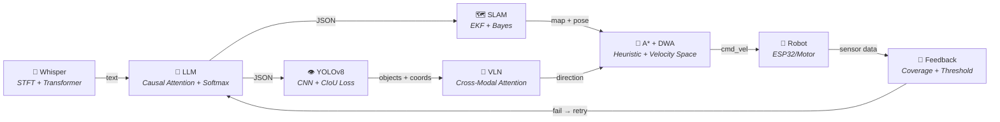

# 📐 Phân Tích Các Mô Hình Toán Học Trong Dự Án VLN-AgriBot

> Tài liệu chi tiết về tất cả các mô hình toán học, thuật toán, và công thức được áp dụng trong từng khâu của hệ thống.

---

## 📊 Tổng Quan Các Mô Hình

| # | Khâu | Mô hình / Thuật toán | Loại toán học |
|---|---|---|---|
| 1 | Khâu 1 — Speech-to-Text | **Whisper (Encoder-Decoder Transformer)** | Xác suất, Attention, Fourier |
| 2 | Khâu 2 — NLU + Planning | **LLM (GPT/LLaMA) — Transformer Decoder** | Attention, Softmax, Cross-Entropy |
| 3 | Khâu 3 — Object Detection | **YOLOv8 — CNN + Anchor-Free Detection** | Convolution, Loss functions |
| 4 | Khâu 3 — SLAM | **EKF-SLAM / Graph-Based SLAM** | Xác suất Bayes, Ma trận, Tối ưu |
| 5 | Khâu 4 — Path Planning | **A\* Algorithm** | Đồ thị, Heuristic |
| 6 | Khâu 4 — Motion Control | **DWA (Dynamic Window Approach)** | Không gian vận tốc, Tối ưu |
| 7 | Khâu 4 — VLN Navigation | **Cross-Modal Attention Model** | Attention đa phương thức |
| 8 | Khâu 5 — Feedback Loop | **Logic đánh giá dựa trên Threshold** | So sánh, Thống kê |

---

## 1. 🎤 WHISPER — Mô Hình Speech-to-Text (Khâu 1)

### 1.1. Bản chất
Whisper là mô hình **Encoder-Decoder Transformer** của OpenAI, nhận đầu vào là **tín hiệu âm thanh** và đầu ra là **chuỗi văn bản**.

### 1.2. Tiền xử lý âm thanh — Log-Mel Spectrogram

Tín hiệu âm thanh thô (waveform) được chuyển đổi thành **Log-Mel Spectrogram** trước khi đưa vào mô hình:

**Bước 1: Short-Time Fourier Transform (STFT)**

$$
X(t, f) = \sum_{n=0}^{N-1} x(n) \cdot w(n - t) \cdot e^{-j2\pi fn/N}
$$

| Ký hiệu | Ý nghĩa |
|---|---|
| $x(n)$ | Tín hiệu âm thanh tại mẫu $n$ |
| $w(n)$ | Hàm cửa sổ (Hann window) |
| $t$ | Vị trí thời gian của frame |
| $f$ | Tần số |
| $N$ | Kích thước FFT (thường 400 cho 25ms window) |

> **Giải thích:** STFT chia tín hiệu âm thanh thành các frame ngắn (25ms), mỗi frame được nhân với hàm cửa sổ Hann rồi biến đổi Fourier để tách phổ tần số tại từng thời điểm.

**Bước 2: Mel Filter Bank**

$$
M(m, f) = \begin{cases} 0 & f < f_{m-1} \\ \frac{f - f_{m-1}}{f_m - f_{m-1}} & f_{m-1} \leq f \leq f_m \\ \frac{f_{m+1} - f}{f_{m+1} - f_m} & f_m < f \leq f_{m+1} \\ 0 & f > f_{m+1} \end{cases}
$$

> **Giải thích:** Bộ lọc Mel mô phỏng cách tai người cảm nhận âm thanh — nhạy bén ở tần số thấp, ít nhạy ở tần số cao. 80 bộ lọc tam giác được phân bố trên thang Mel.

**Bước 3: Chuyển sang thang Mel**

$$
\text{mel}(f) = 2595 \cdot \log_{10}\left(1 + \frac{f}{700}\right)
$$

**Bước 4: Log-Mel Spectrogram**

$$
S_{\text{mel}}(t, m) = \log\left(\sum_f |X(t,f)|^2 \cdot M(m, f) + \epsilon\right)
$$

> $\epsilon$ là hằng số nhỏ tránh $\log(0)$. Kết quả là ma trận 2D (thời gian × 80 kênh Mel) — đây chính là "hình ảnh âm thanh" mà Whisper nhận làm đầu vào.

### 1.3. Encoder — Trích xuất đặc trưng âm thanh

Encoder dùng kiến trúc **Transformer** với **Self-Attention**:

$$
\text{Attention}(Q, K, V) = \text{softmax}\left(\frac{QK^T}{\sqrt{d_k}}\right) V
$$

| Ký hiệu | Ý nghĩa |
|---|---|
| $Q = XW_Q$ | Ma trận Query — "câu hỏi" mỗi vị trí đặt ra |
| $K = XW_K$ | Ma trận Key — "chìa khóa" để so sánh |
| $V = XW_V$ | Ma trận Value — thông tin thực tế cần lấy |
| $d_k$ | Chiều của Key (chia để ổn định gradient) |

> **Giải thích trong ngữ cảnh dự án:** Khi nông dân nói *"Hãy đi kiểm tra khu vực A"*, Encoder Whisper phân tích spectrogram và xác định các phoneme tiếng Việt. Self-Attention cho phép mô hình hiểu ngữ cảnh — ví dụ phân biệt "khu vực" (danh từ) vs nhiễu nền quạt nhà kính.

### 1.4. Decoder — Sinh văn bản

Decoder sinh ra từng token văn bản theo xác suất có điều kiện:

$$
P(y_1, y_2, ..., y_T) = \prod_{t=1}^{T} P(y_t | y_1, ..., y_{t-1}, \mathbf{h}_{\text{enc}})
$$

Với **Cross-Attention** giữa decoder và encoder:

$$
\text{CrossAttn}(Q_{\text{dec}}, K_{\text{enc}}, V_{\text{enc}}) = \text{softmax}\left(\frac{Q_{\text{dec}} K_{\text{enc}}^T}{\sqrt{d_k}}\right) V_{\text{enc}}
$$

> **Ý nghĩa:** Decoder "nhìn lại" đặc trưng âm thanh từ Encoder để quyết định từ tiếp theo. Ví dụ: sau khi sinh *"Hãy đi kiểm tra"*, Cross-Attention tập trung vào phần spectrogram chứa âm "khu vực A" để sinh tiếp.

---

## 2. 🧠 TRANSFORMER / LLM — Hiểu Ý Định (Khâu 2)

### 2.1. Kiến trúc cốt lõi

LLM (GPT/LLaMA) sử dụng kiến trúc **Transformer Decoder-Only** với cơ chế **Causal Self-Attention** (chỉ nhìn các token trước):

$$
\text{CausalAttn}(Q, K, V) = \text{softmax}\left(\frac{QK^T}{\sqrt{d_k}} + M_{\text{causal}}\right) V
$$

Trong đó $M_{\text{causal}}$ là **mask ma trận** tam giác dưới:

$$
M_{\text{causal}}[i,j] = \begin{cases} 0 & \text{nếu } j \leq i \\ -\infty & \text{nếu } j > i \end{cases}
$$

> **Giải thích:** Mask đảm bảo token tại vị trí $i$ chỉ attend đến các token $j \leq i$ (đã sinh trước đó). Giá trị $-\infty$ sau softmax trở thành 0, ngăn "nhìn trước tương lai".

### 2.2. Multi-Head Attention

$$
\text{MultiHead}(Q, K, V) = \text{Concat}(\text{head}_1, ..., \text{head}_h) W^O
$$

$$
\text{head}_i = \text{Attention}(QW_i^Q, KW_i^K, VW_i^V)
$$

> **Giải thích trong ngữ cảnh:** Nhiều "đầu" attention cho phép LLM đồng thời phân tích nhiều khía cạnh của câu lệnh. Ví dụ với *"kiểm tra toàn bộ khu vực A và báo cáo tình trạng cây"*:
> - Head 1 có thể tập trung vào **ý định** ("kiểm tra", "báo cáo")
> - Head 2 tập trung vào **vị trí** ("khu vực A")
> - Head 3 tập trung vào **đối tượng** ("cây")
> - Head 4 tập trung vào **phạm vi** ("toàn bộ")

### 2.3. Feed-Forward Network (FFN)

Sau attention, mỗi token đi qua FFN:

$$
\text{FFN}(x) = \text{GELU}(xW_1 + b_1)W_2 + b_2
$$

**Hàm kích hoạt GELU (Gaussian Error Linear Unit):**

$$
\text{GELU}(x) = x \cdot \Phi(x) = x \cdot \frac{1}{2}\left[1 + \text{erf}\left(\frac{x}{\sqrt{2}}\right)\right]
$$

> **Ý nghĩa:** FFN là nơi mô hình "suy nghĩ" — biến đổi phi tuyến giúp trích xuất thông tin semantic từ biểu diễn attention. GELU mượt hơn ReLU, giúp gradient ổn định hơn.

### 2.4. Hàm mất mát — Cross-Entropy Loss

$$
\mathcal{L} = -\sum_{t=1}^{T} \log P(y_t^* | y_1^*, ..., y_{t-1}^*, X)
$$

> $y_t^*$ là token đúng tại vị trí $t$. Mô hình được huấn luyện để tối đa hóa xác suất sinh ra đúng chuỗi output (JSON Action Script).

### 2.5. Softmax — Phân phối xác suất

$$
P(y_t = w_i) = \text{softmax}(z_i) = \frac{e^{z_i}}{\sum_{j=1}^{|V|} e^{z_j}}
$$

> $|V|$ là kích thước vocabulary. Softmax chuyển logits thô thành phân phối xác suất trên toàn bộ từ vựng, cho phép chọn token có xác suất cao nhất (hoặc sampling).

---

## 3. 👁️ YOLOv8 — Phát Hiện Đối Tượng (Khâu 3)

### 3.1. Kiến trúc tổng quan

YOLOv8 là mô hình **one-stage, anchor-free** object detection gồm 3 phần:

```
Input Image → Backbone (CSPDarknet) → Neck (FPN + PAN) → Head (Detect)
```

### 3.2. Convolution — Phép toán cốt lõi

**Convolution 2D:**

$$
(I * K)(x, y) = \sum_{i}\sum_{j} I(x+i, y+j) \cdot K(i, j)
$$

| Ký hiệu | Ý nghĩa |
|---|---|
| $I$ | Ảnh đầu vào (từ Camera RGB-D) |
| $K$ | Kernel/Filter (bộ lọc học được) |
| $(x, y)$ | Vị trí pixel trên feature map đầu ra |

> **Giải thích:** Mỗi layer convolution quét kernel trên ảnh, trích xuất đặc trưng. Layer đầu phát hiện cạnh, góc; layer sâu hơn phát hiện kết cấu lá, hình dạng quả cà chua, đốm bệnh.

**Batch Normalization:**

$$
\hat{x}_i = \frac{x_i - \mu_B}{\sqrt{\sigma_B^2 + \epsilon}}
$$

$$
y_i = \gamma \hat{x}_i + \beta
$$

> Chuẩn hóa activation giúp huấn luyện nhanh và ổn định hơn. $\gamma, \beta$ là tham số học được.

### 3.3. CSPDarknet Backbone — Cross Stage Partial

Feature map được chia thành 2 nhánh:
- Nhánh 1: đi qua chuỗi Bottleneck blocks
- Nhánh 2: đi thẳng (skip connection)

$$
\mathbf{x}_{\text{out}} = \text{Concat}\left(\mathbf{x}_{\text{branch1}}, \; f_{\text{bottleneck}}(\mathbf{x}_{\text{branch2}})\right)
$$

> **Mục đích:** Giảm tính toán trùng lặp, tăng gradient flow, phù hợp chạy real-time trên robot.

### 3.4. Hàm mất mát YOLOv8

YOLOv8 sử dụng **tổ hợp 3 loss functions**:

$$
\mathcal{L}_{\text{total}} = \lambda_{\text{cls}} \cdot \mathcal{L}_{\text{cls}} + \lambda_{\text{box}} \cdot \mathcal{L}_{\text{box}} + \lambda_{\text{dfl}} \cdot \mathcal{L}_{\text{dfl}}
$$

#### 📌 a) Classification Loss — Binary Cross-Entropy

$$
\mathcal{L}_{\text{cls}} = -\sum_{i} \left[ y_i \log(\hat{y}_i) + (1-y_i)\log(1-\hat{y}_i) \right]
$$

> Phân loại đối tượng: "lá khỏe", "lá vàng", "cà chua chín", "chướng ngại vật", v.v.

#### 📌 b) Box Regression Loss — CIoU (Complete IoU)

$$
\mathcal{L}_{\text{CIoU}} = 1 - \text{IoU} + \frac{\rho^2(\mathbf{b}, \mathbf{b}^{gt})}{c^2} + \alpha v
$$

Trong đó:

$$
\text{IoU} = \frac{|B_{\text{pred}} \cap B_{\text{gt}}|}{|B_{\text{pred}} \cup B_{\text{gt}}|}
$$

| Ký hiệu | Ý nghĩa |
|---|---|
| $\rho(\mathbf{b}, \mathbf{b}^{gt})$ | Khoảng cách Euclid giữa tâm predicted box và ground truth box |
| $c$ | Đường chéo của hình chữ nhật nhỏ nhất bao cả 2 box |
| $v$ | Hệ số tỷ lệ khung hình: $v = \frac{4}{\pi^2}\left(\arctan\frac{w^{gt}}{h^{gt}} - \arctan\frac{w}{h}\right)^2$ |
| $\alpha$ | Trọng số cân bằng: $\alpha = \frac{v}{(1 - \text{IoU}) + v}$ |

> **Giải thích trong ngữ cảnh:** CIoU giúp bounding box predicted "ôm khít" đối tượng thực tế. Khi robot quét qua cây cà chua, CIoU đảm bảo khung phát hiện bao trọn lá bệnh mà không thừa/thiếu, giúp xác định vị trí chính xác để phun thuốc.

#### 📌 c) Distribution Focal Loss (DFL)

$$
\mathcal{L}_{\text{DFL}} = -\left((y_{i+1} - y) \log(S_i) + (y - y_i) \log(S_{i+1})\right)
$$

> DFL mô hình hóa biên bounding box dưới dạng phân phối xác suất rời rạc, tăng độ chính xác vị trí biên.

### 3.5. Non-Maximum Suppression (NMS)

Sau khi detect, NMS loại bỏ các box trùng lặp:

```
1. Sắp xếp boxes theo confidence giảm dần
2. Chọn box có confidence cao nhất
3. Loại bỏ các box có IoU > threshold (0.45) với box đã chọn
4. Lặp lại từ bước 2 cho đến hết
```

> **Ví dụ:** Khi quét 1 lá vàng, YOLOv8 có thể sinh ra 5 box trùng nhau. NMS chỉ giữ lại box tốt nhất, tránh đếm trùng khi thống kê (ví dụ: "12 cây bất thường", không phải "50 lá bất thường").

---

## 4. 🗺️ SLAM — Localization & Mapping (Khâu 3)

### 4.1. Bài toán SLAM

SLAM giải đồng thời 2 bài toán:
- **Localization**: Robot đang ở đâu? → Ước lượng **pose** $(x, y, \theta)$
- **Mapping**: Môi trường trông như thế nào? → Xây dựng **bản đồ**

### 4.2. Mô hình chuyển động (Motion Model)

$$
\mathbf{x}_t = f(\mathbf{x}_{t-1}, \mathbf{u}_t) + \mathbf{w}_t
$$

| Ký hiệu | Ý nghĩa |
|---|---|
| $\mathbf{x}_t = (x, y, \theta)_t$ | Trạng thái robot tại thời điểm $t$ |
| $\mathbf{u}_t$ | Lệnh điều khiển (vận tốc tuyến tính $v$, vận tốc góc $\omega$) |
| $\mathbf{w}_t$ | Nhiễu quá trình ~ $\mathcal{N}(0, Q_t)$ |

**Cụ thể cho robot differential drive:**

$$
\begin{bmatrix} x_t \\ y_t \\ \theta_t \end{bmatrix} = \begin{bmatrix} x_{t-1} + v_t \cdot \Delta t \cdot \cos(\theta_{t-1}) \\ y_{t-1} + v_t \cdot \Delta t \cdot \sin(\theta_{t-1}) \\ \theta_{t-1} + \omega_t \cdot \Delta t \end{bmatrix}
$$

> **Giải thích:** Đây là phương trình chuyển động cơ bản. Robot biết "tôi vừa đi thẳng 0.5m rồi rẽ trái 30°" → ước lượng vị trí mới. Nhưng encoder bánh xe có sai số (trượt trên nền ướt trong nhà kính) → cần SLAM hiệu chỉnh.

### 4.3. Mô hình quan sát (Observation Model)

$$
\mathbf{z}_t = h(\mathbf{x}_t, \mathbf{m}) + \mathbf{v}_t
$$

| Ký hiệu | Ý nghĩa |
|---|---|
| $\mathbf{z}_t$ | Dữ liệu đo từ Camera RGB-D (depth image) |
| $h(\cdot)$ | Hàm chiếu — liên hệ vị trí robot với quan sát kỳ vọng |
| $\mathbf{m}$ | Bản đồ (tập hợp các landmark/điểm đặc trưng) |
| $\mathbf{v}_t$ | Nhiễu quan sát ~ $\mathcal{N}(0, R_t)$ |

### 4.4. EKF-SLAM (Extended Kalman Filter)

**Bước Predict:**

$$
\hat{\mathbf{x}}_t^{-} = f(\hat{\mathbf{x}}_{t-1}, \mathbf{u}_t)
$$

$$
P_t^{-} = F_t P_{t-1} F_t^T + Q_t
$$

| Ký hiệu | Ý nghĩa |
|---|---|
| $\hat{\mathbf{x}}_t^{-}$ | Ước lượng trạng thái tiên nghiệm |
| $P_t^{-}$ | Ma trận hiệp phương sai tiên nghiệm |
| $F_t = \frac{\partial f}{\partial \mathbf{x}}\bigg|_{\hat{\mathbf{x}}_{t-1}}$ | Jacobian của mô hình chuyển động |

**Bước Update (khi có quan sát):**

$$
K_t = P_t^{-} H_t^T (H_t P_t^{-} H_t^T + R_t)^{-1}
$$

$$
\hat{\mathbf{x}}_t = \hat{\mathbf{x}}_t^{-} + K_t (\mathbf{z}_t - h(\hat{\mathbf{x}}_t^{-}, \mathbf{m}))
$$

$$
P_t = (I - K_t H_t) P_t^{-}
$$

| Ký hiệu | Ý nghĩa |
|---|---|
| $K_t$ | **Kalman Gain** — cân bằng giữa tin vào mô hình vs tin vào cảm biến |
| $H_t = \frac{\partial h}{\partial \mathbf{x}}$ | Jacobian của mô hình quan sát |
| $\mathbf{z}_t - h(\hat{\mathbf{x}}_t^{-})$ | **Innovation** — sai lệch giữa quan sát thực tế và dự đoán |

> **Giải thích trực quan:** Mỗi khi robot di chuyển, vị trí ước lượng "trôi" dần do sai số tích lũy. Khi camera nhìn thấy cột nhà kính hoặc landmark quen thuộc, Kalman Filter "kéo" ước lượng về đúng vị trí. $K_t$ quyết định tin vào cảm biến hay mô hình nhiều hơn.

### 4.5. Occupancy Grid Map

Bản đồ được biểu diễn dưới dạng lưới, mỗi ô có xác suất bị chiếm:

$$
P(m_i | z_{1:t}, x_{1:t}) = \frac{1}{1 + e^{-l_i}}
$$

Trong đó log-odds được cập nhật:

$$
l_i = l_{i,\text{prev}} + \log\frac{P(m_i | z_t)}{1 - P(m_i | z_t)} - l_0
$$

> **Ý nghĩa:** Mỗi ô trên bản đồ có giá trị: 0 = trống (lối đi), 1 = chiếm (cột nhà kính, luống cây), 0.5 = chưa biết. Khi robot quét nhiều lần, xác suất được cập nhật chính xác hơn.

---

## 5. 🧭 A* — Path Planning (Khâu 4)

### 5.1. Hàm đánh giá

A* tìm đường đi ngắn nhất trên bản đồ SLAM:

$$
f(n) = g(n) + h(n)
$$

| Ký hiệu | Ý nghĩa |
|---|---|
| $f(n)$ | Tổng chi phí ước lượng qua node $n$ |
| $g(n)$ | Chi phí thực tế từ điểm xuất phát đến $n$ |
| $h(n)$ | **Heuristic** — chi phí ước lượng từ $n$ đến đích |

### 5.2. Heuristic — Euclidean Distance

$$
h(n) = \sqrt{(x_n - x_{\text{goal}})^2 + (y_n - y_{\text{goal}})^2}
$$

> **Tính chất Admissible:** Heuristic Euclidean không bao giờ overestimate khoảng cách thực → A* đảm bảo tìm đường tối ưu.

### 5.3. Thuật toán

```
1. Khởi tạo OPEN = {start}, CLOSED = {}
2. Lặp:
   a. Chọn node n có f(n) nhỏ nhất từ OPEN
   b. Nếu n = goal → truy vết đường đi, DONE
   c. Chuyển n sang CLOSED
   d. Với mỗi neighbor m của n:
      - Nếu m ∈ CLOSED hoặc m là obstacle → bỏ qua
      - g_new = g(n) + cost(n, m)
      - Nếu g_new < g(m) → cập nhật g(m), parent(m) = n
      - Thêm m vào OPEN
```

> **Trong ngữ cảnh nhà kính:** A* tìm đường từ vị trí robot hiện tại đến hàng cây cần kiểm tra, tránh các ô bị chiếm (cột nhà kính, ống tưới). Chi phí $\text{cost}(n, m)$ có thể tăng gần chướng ngại vật để robot giữ khoảng cách an toàn.

---

## 6. 🚗 DWA — Dynamic Window Approach (Khâu 4)

### 6.1. Không gian vận tốc

DWA tìm **cặp vận tốc tối ưu** $(v, \omega)$ trong "cửa sổ động":

$$
V_s = \{(v, \omega) \;|\; v \in [0, v_{\max}], \; \omega \in [-\omega_{\max}, \omega_{\max}]\}
$$

**Ràng buộc vật lý (giới hạn gia tốc):**

$$
V_d = \{(v, \omega) \;|\; v \in [v_c - \dot{v}_{\max}\Delta t, \; v_c + \dot{v}_{\max}\Delta t], \; \omega \in [\omega_c - \dot{\omega}_{\max}\Delta t, \; \omega_c + \dot{\omega}_{\max}\Delta t]\}
$$

**Ràng buộc an toàn (có thể dừng trước vật cản):**

$$
V_a = \{(v, \omega) \;|\; v \leq \sqrt{2 \cdot \text{dist}(v, \omega) \cdot \dot{v}_{\max}}\}
$$

**Cửa sổ tìm kiếm:**

$$
V_r = V_s \cap V_d \cap V_a
$$

### 6.2. Hàm mục tiêu

$$
G(v, \omega) = \sigma\Big(\alpha \cdot \text{heading}(v, \omega) + \beta \cdot \text{dist}(v, \omega) + \gamma \cdot \text{vel}(v, \omega)\Big)
$$

| Thành phần | Ý nghĩa |
|---|---|
| $\text{heading}(v, \omega)$ | Góc lệch giữa hướng robot tại cuối quỹ đạo và hướng đến đích — **nhỏ = tốt** |
| $\text{dist}(v, \omega)$ | Khoảng cách đến vật cản gần nhất trên quỹ đạo — **xa = tốt** |
| $\text{vel}(v, \omega)$ | Vận tốc tuyến tính — **nhanh = tốt** (ưu tiên di chuyển nhanh) |
| $\alpha, \beta, \gamma$ | Trọng số điều chỉnh ưu tiên (tuning cho nhà kính: $\beta$ cao vì lối đi hẹp) |

**Chọn vận tốc tối ưu:**

$$
(v^*, \omega^*) = \arg\max_{(v, \omega) \in V_r} G(v, \omega)
$$

> **Giải thích trong ngữ cảnh:** DWA chạy liên tục ở tần số 10-20Hz. Mỗi chu kỳ, nó "mô phỏng" hàng trăm cặp $(v, \omega)$ có thể, vẽ quỹ đạo cho mỗi cặp, rồi chọn cặp tốt nhất. Trong lối đi hẹp giữa các luống cà chua, $\beta$ (trọng số khoảng cách) được đặt cao để robot giữ khoảng cách an toàn.

---

## 7. 🔗 VLN — Cross-Modal Attention (Khâu 4)

### 7.1. Bài toán VLN

VLN kết hợp 2 modality: **ngôn ngữ** ($L$) và **thị giác** ($V$) để ra quyết định điều hướng tại mỗi bước:

$$
a_t = \pi(a | L, V_t, h_{t-1})
$$

| Ký hiệu | Ý nghĩa |
|---|---|
| $a_t$ | Hành động tại bước $t$ (rẽ trái, đi thẳng, dừng, ...) |
| $L$ | Biểu diễn ngôn ngữ (embedding câu lệnh) |
| $V_t$ | Biểu diễn thị giác tại bước $t$ (features từ camera) |
| $h_{t-1}$ | Hidden state — bộ nhớ các bước trước |

### 7.2. Language Encoding

Câu lệnh được encode qua Bidirectional LSTM hoặc Transformer:

$$
\mathbf{l}_1, \mathbf{l}_2, ..., \mathbf{l}_n = \text{BiLSTM}(\text{Embed}(w_1, w_2, ..., w_n))
$$

### 7.3. Visual Encoding

Ảnh panoramic 360° từ camera được chia thành $K$ hướng nhìn (viewpoints):

$$
\mathbf{v}_t^k = \text{CNN}(\text{Image}_t^k), \quad k = 1, ..., K
$$

### 7.4. Cross-Modal Attention (Lõi VLN)

**Language-conditioned visual attention:**

$$
\alpha_t^k = \text{softmax}\left(\frac{(\mathbf{h}_{t-1} W_Q)(\mathbf{v}_t^k W_K)^T}{\sqrt{d}}\right)
$$

$$
\tilde{\mathbf{v}}_t = \sum_{k=1}^{K} \alpha_t^k \cdot \mathbf{v}_t^k
$$

**Vision-conditioned language attention:**

$$
\beta_t^i = \text{softmax}\left(\frac{(\tilde{\mathbf{v}}_t W_Q')(\mathbf{l}_i W_K')^T}{\sqrt{d}}\right)
$$

$$
\tilde{\mathbf{l}}_t = \sum_{i=1}^{n} \beta_t^i \cdot \mathbf{l}_i
$$

> **Giải thích trực quan:** Khi câu lệnh là *"đi đến khu vực A"* và robot nhìn thấy biển "Zone A" ở bên trái + luống cà chua ở bên phải:
> - **Visual attention** $\alpha_t^k$: trọng số cao cho hướng nhìn chứa biển "Zone A"
> - **Language attention** $\beta_t^i$: trọng số cao cho từ "khu vực A"
> → Kết hợp → Quyết định: **rẽ trái** (về phía biển Zone A)

### 7.5. Action Prediction

$$
h_t = \text{LSTM}(h_{t-1}, [\tilde{\mathbf{v}}_t; \tilde{\mathbf{l}}_t; a_{t-1}])
$$

$$
P(a_t = a^j) = \text{softmax}(\mathbf{h}_t^T \mathbf{c}^j)
$$

Trong đó $\mathbf{c}^j$ là embedding của ứng viên hành động $j$ (forward, left, right, stop).

> **Ý nghĩa:** LSTM duy trì bộ nhớ qua các bước, cho phép robot "nhớ" nó đã thăm hàng nào rồi. Xác suất hành động giúp robot chọn bước tiếp theo chính xác nhất.

---

## 8. 📡 FEEDBACK LOOP — Logic Đánh Giá (Khâu 5)

### 8.1. Coverage Metric

$$
\text{Coverage} = \frac{N_{\text{scanned}}}{N_{\text{total}}} \times 100\%
$$

### 8.2. Task Completion

$$
\text{Success} = \begin{cases} \text{TRUE} & \text{nếu Coverage} \geq \tau_{\text{coverage}} \;\text{AND}\; \text{AllSubTasksDone} \\ \text{FALSE} & \text{ngược lại} \end{cases}
$$

> $\tau_{\text{coverage}}$ là ngưỡng (ví dụ 95%). Nếu Coverage < 95% (do hết pin, gặp lỗi) → quay lại Khâu 2 lên kế hoạch scan phần còn lại.

### 8.3. Plant Health Score

$$
\text{HealthScore}_{\text{zone}} = \frac{N_{\text{healthy}}}{N_{\text{total}}} \times 100\%
$$

> **Ví dụ trong dự án:** Zone A: 438/450 = 97.3% khỏe mạnh, 12/450 = 2.7% bất thường → Đưa vào báo cáo cho nông dân.

---

## 🔑 Tóm Tắt Mối Liên Hệ Giữa Các Mô Hình



> Mỗi mô hình toán học đóng vai trò **một mắt xích** trong pipeline. Đầu ra có cấu trúc toán học của mô hình này trở thành đầu vào cho mô hình tiếp theo, tạo nên hệ thống AI hoàn chỉnh từ **giọng nói → hành động vật lý → phản hồi**.
