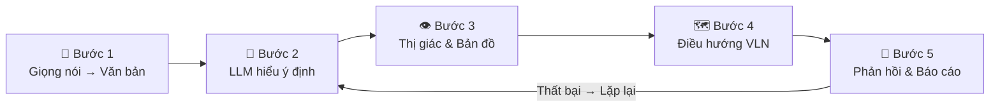
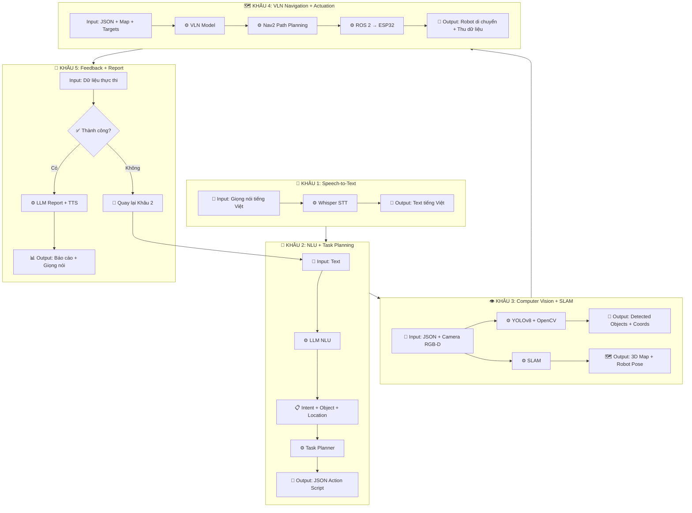

# 📋 TÀI LIỆU DỰ ÁN VLN-AgriBot

## Thiết Kế & Phát Triển Robot Trợ Lý Nông Nghiệp Trong Nhà Kính Thông Minh
**Ứng dụng công nghệ Vision-Language Navigation (VLN)**

> Nghiên cứu Khoa Học 2026 — Việt Nam 🇻🇳

---

## 1. ĐẶT VẤN ĐỀ

Nông nghiệp trong nhà kính tại Việt Nam đang đối mặt với nhiều thách thức lớn:

| Thách thức | Mô tả |
|---|---|
| **Thiếu hụt nhân lực** | Lao động nông nghiệp giảm từ ~70% xuống ~27% trong 2 thập kỷ |
| **Điều kiện khắc nghiệt** | Nhiệt độ nhà kính lên tới 45–50°C, tiếp xúc hóa chất |
| **Quản lý thủ công** | Giám sát dựa vào cảm tính, thiếu dữ liệu khoa học |
| **Robot chưa đủ thông minh** | Chỉ đi theo lộ trình cố định, không hiểu ngôn ngữ tự nhiên |
| **Thiếu tích hợp AI & IoT** | Việc ứng dụng AI/IoT vào nhà kính Việt Nam còn rất hạn chế |

> **Câu hỏi nghiên cứu:** Làm thế nào để xây dựng robot có khả năng hiểu lệnh giọng nói, tự nhìn–hiểu–di chuyển trong nhà kính, và thực thi tác vụ nông nghiệp tự động?

---

## 2. GIẢI PHÁP ĐỘT PHÁ — HỆ THỐNG VLN AgriBot

Ứng dụng **Vision-Language Navigation (VLN)** — cho phép robot hiểu ngôn ngữ tự nhiên, nhìn môi trường và tự điều hướng để thực thi tác vụ nông nghiệp.

### 2.1. Tổng quan Workflow hệ thống



---

### 2.2. Phân tích chi tiết từng khâu Workflow

#### 🔷 KHÂU 1: Người dùng ra lệnh bằng giọng nói (Speech-to-Text)

| Thành phần | Chi tiết |
|---|---|
| **ĐẦU VÀO** | Tín hiệu âm thanh giọng nói tiếng Việt từ nông dân (qua microphone trên robot) |
| **Công nghệ biến đổi** | **OpenAI Whisper** — mô hình Speech-to-Text đa ngôn ngữ. Whisper nhận âm thanh dạng waveform, xử lý qua encoder–decoder transformer để tạo ra chuỗi văn bản |
| **ĐẦU RA** | Chuỗi văn bản tiếng Việt (plain text), ví dụ: `"Hãy đi kiểm tra toàn bộ khu vực A và báo cáo tình trạng cây"` |
| **Mục đích cho khâu tiếp theo** | Cung cấp **đầu vào dạng text** để LLM ở Khâu 2 có thể phân tích ngữ nghĩa và trích xuất ý định hành động |

---

#### 🔷 KHÂU 2: LLM hiểu ý định & Lập kế hoạch (NLU + Task Planning)

| Thành phần | Chi tiết |
|---|---|
| **ĐẦU VÀO** | Chuỗi văn bản tiếng Việt từ Khâu 1, ví dụ: `"Hãy đi kiểm tra toàn bộ khu vực A và báo cáo tình trạng cây"` |
| **Công nghệ biến đổi** | **LLM (GPT/LLaMA)** — Mô hình ngôn ngữ lớn thực hiện Natural Language Understanding (NLU): phân tích ngữ nghĩa câu lệnh để trích xuất 3 thành phần chính: **Intent** (ý định), **Object** (đối tượng), **Location** (vị trí). Sau đó, **Task Planner** chuyển đổi kết quả NLU thành kịch bản hành động dạng cấu trúc JSON |
| **ĐẦU RA** | **JSON Action Script** — kịch bản hành động có cấu trúc, ví dụ: |

```json
{
  "task_id": "TASK-001",
  "intent": "inspect",
  "object": "cây trồng",
  "location": "khu_vực_A",
  "sub_tasks": [
    {"action": "navigate", "target": "khu_vực_A_start"},
    {"action": "scan", "mode": "full_area", "capture": true},
    {"action": "analyze", "type": "plant_health"},
    {"action": "report", "format": "summary"}
  ]
}
```

| **Mục đích cho khâu tiếp theo** | Cung cấp **kịch bản hành động cụ thể** (JSON) cho hệ thống thị giác (Khâu 3) biết cần nhận diện đối tượng nào, và cho hệ thống điều hướng (Khâu 4) biết cần đi đến đâu, làm gì |

---

#### 🔷 KHÂU 3: Thị giác & Bản đồ — Xác định mục tiêu (Computer Vision + SLAM)

| Thành phần | Chi tiết |
|---|---|
| **ĐẦU VÀO** | (1) **JSON Action Script** từ Khâu 2 — biết cần tìm đối tượng gì, ở đâu. (2) **Dữ liệu hình ảnh real-time** từ Camera RGB-D (ảnh màu + ảnh chiều sâu) gắn trên robot |
| **Công nghệ biến đổi** | **YOLOv8** — phát hiện và phân loại đối tượng real-time (cây trồng, quả, lá bệnh, chướng ngại vật). **OpenCV** — tiền xử lý ảnh, tăng cường chất lượng, trích xuất đặc trưng. **SLAM (Simultaneous Localization and Mapping)** — xây dựng bản đồ 3D của nhà kính và xác định vị trí hiện tại của robot trong bản đồ đó |
| **ĐẦU RA** | (1) **Danh sách đối tượng detected** với tọa độ (bounding box, vị trí 3D), nhãn phân loại (ví dụ: "cây khỏe", "lá vàng", "chướng ngại vật"). (2) **Bản đồ SLAM** cập nhật (occupancy grid map) với vị trí robot hiện tại (pose estimation) |
| **Mục đích cho khâu tiếp theo** | Cung cấp cho Khâu 4: (a) **Bản đồ môi trường** để hệ thống path planning tìm đường đi tối ưu tránh vật cản. (b) **Tọa độ mục tiêu** (vị trí cây cần kiểm tra, vị trí khu vực A) để robot biết điểm đến cụ thể |

---

#### 🔷 KHÂU 4: Điều hướng VLN & Thực thi hành động (Navigation + Actuation)

| Thành phần | Chi tiết |
|---|---|
| **ĐẦU VÀO** | (1) **JSON Action Script** từ Khâu 2 — biết cần thực hiện hành động gì. (2) **Bản đồ SLAM + tọa độ mục tiêu** từ Khâu 3 — biết đi đâu, tránh gì. (3) **Context ngôn ngữ** từ Khâu 2 — giúp VLN kết hợp hiểu ngữ cảnh lệnh với hình ảnh |
| **Công nghệ biến đổi** | **VLN Navigation Model** — mô hình đa phương thức kết hợp ngôn ngữ + thị giác để ra quyết định di chuyển từng bước (turn left, go forward, stop). **Nav2 (Navigation 2)** — framework path planning trong ROS 2, sử dụng thuật toán A*/DWA để tính đường đi tối ưu tránh vật cản. **ROS 2 Middleware** — lớp trung gian giao tiếp giữa máy tính chính và vi điều khiển. **ESP32/STM32** — vi điều khiển nhận lệnh từ ROS 2, điều khiển phần cứng: motor bánh xe, bơm nước, đèn chiếu, cánh tay robot |
| **ĐẦU RA** | (1) **Robot di chuyển vật lý** đến đúng vị trí mục tiêu trong nhà kính. (2) **Thực thi tác vụ vật lý**: chụp ảnh cận cảnh, bơm nước, phun thuốc, thu hoạch,... (3) **Dữ liệu thu thập tại hiện trường**: ảnh cây, readings từ cảm biến IoT (độ ẩm, nhiệt độ đất,...) |
| **Mục đích cho khâu tiếp theo** | Cung cấp cho Khâu 5: (a) **Kết quả thực thi** — robot đã làm gì, ở đâu. (b) **Dữ liệu thực tế thu được** — ảnh, đo lường cảm biến — để hệ thống đánh giá kết quả và tạo báo cáo |

---

#### 🔷 KHÂU 5: Phản hồi vòng lặp & Báo cáo (Feedback Loop + Report)

| Thành phần | Chi tiết |
|---|---|
| **ĐẦU VÀO** | (1) **Dữ liệu thực thi** từ Khâu 4 — ảnh chụp, dữ liệu cảm biến, trạng thái hoàn thành/thất bại. (2) **JSON Action Script gốc** từ Khâu 2 — so sánh mục tiêu ban đầu vs kết quả thực tế |
| **Công nghệ biến đổi** | **IoT Sensors** — cảm biến đánh giá kết quả (ví dụ: cảm biến độ ẩm xác nhận đã tưới đủ nước). **Camera** — chụp ảnh xác nhận trạng thái sau khi thực thi. **Logic đánh giá (Feedback Loop)** — so sánh kết quả thực tế với mục tiêu; nếu **thất bại** → quay lại Khâu 2 để lên kế hoạch lại; nếu **thành công** → chuyển sang tạo báo cáo. **LLM Report Generator** — LLM tổng hợp toàn bộ dữ liệu thành báo cáo bằng tiếng Việt. **Text-to-Speech** — chuyển báo cáo thành giọng nói phát qua loa |
| **ĐẦU RA** | (1) **Báo cáo tổng hợp** (text + voice) về kết quả thực hiện nhiệm vụ. (2) **Quyết định vòng lặp**: thành công → kết thúc, thất bại → quay lại Khâu 2 |
| **Mục đích** | (a) Cung cấp thông tin kết quả cho nông dân. (b) Đảm bảo tính **tự điều chỉnh (self-correcting)** — robot không bỏ dở nhiệm vụ khi gặp lỗi |

---

## 3. KIẾN THỨC CỐT LÕI ĐƯỢC ÁP DỤNG

| Lĩnh vực | Công nghệ | Vai trò trong hệ thống |
|---|---|---|
| **Xử lý ngôn ngữ tự nhiên (NLP)** | Whisper, GPT/LLaMA | Giọng nói → văn bản → hiểu ý định |
| **Thị giác máy tính (CV)** | YOLOv8, OpenCV, Camera RGB-D | Nhận diện đối tượng, đo chiều sâu |
| **Vision-Language Navigation** | VLN Model | Kết hợp ngôn ngữ + thị giác → điều hướng |
| **Robotics & Hệ thống nhúng** | ROS 2, Nav2, ESP32/STM32 | Giao tiếp, path planning, điều khiển phần cứng |
| **IoT & Cảm biến** | Sensors (độ ẩm, nhiệt độ,...) | Thu thập dữ liệu môi trường, đánh giá kết quả |

---

## 4. VÌ SAO VLN LÀ GIẢI PHÁP ĐỘT PHÁ?

- ✅ **Tương tác tự nhiên** — Nông dân chỉ cần nói tiếng Việt, không cần biết lập trình
- ✅ **Đa phương thức (Multimodal)** — Kết hợp ngôn ngữ + thị giác, vượt trội so với robot cảm biến đơn lẻ
- ✅ **Thích ứng linh hoạt** — Không cần lập trình lại khi thay đổi layout nhà kính hay loại cây
- ✅ **Mã nguồn mở** — ROS 2, YOLOv8, Whisper → giảm chi phí, dễ mở rộng

---

## 5. GIÁ TRỊ THỰC TIỄN CHO VIỆT NAM

### 🔬 Giá trị Khoa học
- Xây dựng bộ dataset tiếng Việt cho VLN nông nghiệp
- Nghiên cứu tích hợp đa phương thức trong môi trường thực tế
- Đề xuất mô hình VLN phù hợp nhà kính Việt Nam

### 💻 Giá trị Công nghệ
- Hệ thống ROS 2 hoàn chỉnh cho robot nông nghiệp
- Pipeline AI: Speech → NLU → Vision → Navigation → Action
- Thiết kế phần cứng với linh kiện có sẵn trong nước

### 🌾 Giá trị Nông nghiệp
- Giảm **40–60%** nhân công cho các tác vụ lặp lại
- Tăng năng suất nhờ giám sát **24/7** liên tục
- Phát hiện sâu bệnh sớm, giảm tổn thất mùa vụ

### 🇻🇳 Giá trị Quốc gia
- Phù hợp chiến lược chuyển đổi số nông nghiệp
- Xây dựng nguồn nhân lực AI + Robotics
- Tiềm năng thương mại hóa & xuất khẩu công nghệ

---

## 6. KỊCH BẢN ỨNG DỤNG TRONG NHÀ KÍNH

Mô phỏng một ngày làm việc thực tế của VLN AgriBot trong nhà kính trồng cà chua tại Đà Lạt:

| Thời gian | Tác vụ | Lệnh giọng nói |
|---|---|---|
| 🌅 06:00 | Tuần tra & giám sát tổng quan | *"Hãy đi kiểm tra toàn bộ khu vực A và báo cáo tình trạng cây"* |
| 💧 08:00 | Tưới nước tự động theo vùng | *"Tưới nước cho hàng cà chua số 3 đến số 7, mỗi hàng 2 lít"* |
| 🔍 10:00 | Phát hiện & xử lý sâu bệnh | *"Kiểm tra lá cây ở hàng 5, nếu phát hiện sâu thì phun thuốc"* |
| 🌱 14:00 | Thu hoạch & phân loại | *"Thu hoạch cà chua chín ở khu vực B, phân loại loại 1 và loại 2"* |
| 📊 17:00 | Tổng kết & báo cáo | 🤖 *"Đã kiểm tra 450 cây, tưới 280L nước, phát hiện 12 cây bệnh, thu hoạch 35kg loại 1"* |

---

## 7. 🔍 VÍ DỤ PHÂN TÍCH THEO TỪNG KHÂU

### Hoạt động: "Kiểm tra tình trạng cây ở toàn bộ khu vực A"

> Bối cảnh: Sáng sớm 06:00, nông dân muốn robot đi kiểm tra toàn bộ khu vực A trong nhà kính trồng cà chua. Nông dân đứng gần robot và ra lệnh bằng giọng nói.

---

#### ▶ KHÂU 1 — Speech-to-Text

| | Chi tiết |
|---|---|
| **Đầu vào** | Nông dân nói vào microphone: *"Hãy đi kiểm tra toàn bộ khu vực A và báo cáo tình trạng cây"* — tín hiệu audio dạng waveform, tiếng Việt giọng miền Trung |
| **Xử lý** | **Whisper** nhận audio → tiền xử lý (lọc nhiễu nền từ quạt nhà kính, tiếng motor) → encoder–decoder transformer nhận diện từng phoneme và từ → giải mã ra chuỗi text |
| **Đầu ra** | `"Hãy đi kiểm tra toàn bộ khu vực A và báo cáo tình trạng cây"` (text, confidence: 97.2%) |
| **Phục vụ Khâu 2** | Text này trở thành input cho LLM phân tích ngữ nghĩa |

---

#### ▶ KHÂU 2 — LLM Hiểu Ý Định & Lập Kế Hoạch

| | Chi tiết |
|---|---|
| **Đầu vào** | Text: `"Hãy đi kiểm tra toàn bộ khu vực A và báo cáo tình trạng cây"` |
| **Xử lý** | **LLM (GPT/LLaMA)** phân tích: |

**Bước 2a — NLU (Natural Language Understanding):**
- Trích xuất **Intent**: `inspect` (kiểm tra)
- Trích xuất **Object**: `cây trồng` (tình trạng cây)
- Trích xuất **Location**: `khu_vực_A` (toàn bộ khu vực A)
- Trích xuất **Output**: `report` (báo cáo)

**Bước 2b — Task Planner tạo JSON Action Script:**

```json
{
  "task_id": "INSPECT-KV_A-20260326-0600",
  "intent": "inspect",
  "object": "plant_health",
  "location": "zone_A",
  "coverage": "full",
  "sub_tasks": [
    {
      "step": 1,
      "action": "navigate",
      "target": "zone_A_row_1_start",
      "description": "Di chuyển đến điểm bắt đầu hàng 1 khu vực A"
    },
    {
      "step": 2,
      "action": "scan_row",
      "mode": "sequential",
      "capture": true,
      "targets": ["leaf_color", "stem_health", "fruit_status", "pest_detection"],
      "description": "Quét toàn bộ hàng, chụp ảnh, phân tích từng cây"
    },
    {
      "step": 3,
      "action": "move_next_row",
      "repeat_until": "zone_A_complete",
      "description": "Chuyển sang hàng tiếp theo cho đến hết khu vực A"
    },
    {
      "step": 4,
      "action": "generate_report",
      "format": "summary_vi",
      "include": ["total_plants", "healthy_count", "diseased_count", "anomaly_details"],
      "description": "Tổng hợp báo cáo bằng tiếng Việt"
    }
  ]
}
```

| | Chi tiết |
|---|---|
| **Đầu ra** | JSON Action Script như trên — bao gồm 4 sub-tasks rõ ràng |
| **Phục vụ Khâu 3** | Cung cấp thông tin: cần nhận diện `leaf_color`, `stem_health`, `pest_detection` → Khâu 3 biết phải configure YOLOv8 để detect những class nào |

---

#### ▶ KHÂU 3 — Thị Giác & Bản Đồ

| | Chi tiết |
|---|---|
| **Đầu vào** | (1) JSON biết cần scan `zone_A`, detect `leaf_color, stem_health, fruit_status, pest_detection`. (2) Camera RGB-D bắt đầu stream video real-time khi robot di chuyển |
| **Xử lý** | |

**Bước 3a — SLAM xây dựng bản đồ:**
- Robot kích hoạt SLAM → sử dụng dữ liệu depth từ Camera RGB-D + encoder bánh xe (odometry)
- Xây dựng **occupancy grid map** của khu vực A: xác định đâu là lối đi, đâu là luống cây, đâu là chướng ngại vật (cột nhà kính, ống tưới)
- Xác định vị trí hiện tại của robot trên bản đồ (pose: x, y, θ)

**Bước 3b — YOLOv8 phát hiện đối tượng:**
- Với mỗi frame ảnh, YOLOv8 detect:
  - 🌿 Lá xanh khỏe mạnh → label: `healthy_leaf`, confidence: 95%
  - 🍂 Lá vàng úa → label: `yellowing_leaf`, confidence: 89%
  - 🦟 Đốm bệnh trên lá → label: `leaf_spot_disease`, confidence: 92%
  - 🍅 Quả cà chua xanh/chín → label: `tomato_green` / `tomato_ripe`
  - 🪵 Chướng ngại vật → label: `obstacle`

**Bước 3c — Ghi nhận kết quả cho từng cây:**
- Tại **Cây #A-012**: phát hiện 3 lá vàng, 1 đốm bệnh → đánh dấu `anomaly` + lưu ảnh
- Tại **Cây #A-045**: 100% lá xanh, quả phát triển bình thường → `healthy`
- ...Lặp lại cho toàn bộ cây trong khu vực A

| | Chi tiết |
|---|---|
| **Đầu ra** | (1) **Bản đồ SLAM** hoàn chỉnh của khu vực A. (2) **Danh sách detection**: 450 cây đã scan, mỗi cây có label + tọa độ + ảnh chụp |
| **Phục vụ Khâu 4** | (a) Bản đồ SLAM → Nav2 tính đường đi tối ưu giữa các hàng. (b) Tọa độ cây bất thường → robot biết dừng lại chụp ảnh cận cảnh ở đâu |

---

#### ▶ KHÂU 4 — Điều Hướng VLN & Thực Thi

| | Chi tiết |
|---|---|
| **Đầu vào** | (1) JSON Action Script: navigate → scan → move_next → report. (2) Bản đồ SLAM + vị trí robot. (3) Tọa độ các hàng cây trong khu vực A |
| **Xử lý** | |

**Bước 4a — VLN Navigation ra quyết định:**
- VLN Model nhận: lệnh `"kiểm tra toàn bộ khu vực A"` + ảnh camera hiện tại
- Kết hợp ngữ cảnh ngôn ngữ ("khu vực A") với nhận diện thị giác (thấy biển hiệu "Zone A", thấy luống cây) → ra quyết định: rẽ trái vào hàng 1

**Bước 4b — Nav2 Path Planning:**
- Nav2 nhận bản đồ SLAM + vị trí đích (hàng 1 khu vực A)
- Thuật toán A* tính đường đi ngắn nhất tránh cột nhà kính và ống tưới
- DWA (Dynamic Window Approach) tạo lệnh vận tốc real-time

**Bước 4c — ROS 2 → ESP32 → Phần cứng:**
- ROS 2 publish `/cmd_vel` (vận tốc) → ESP32 nhận qua serial/WiFi
- ESP32 điều khiển motor bánh xe: tiến, lùi, rẽ
- Tại mỗi cây bất thường → robot dừng → camera chụp ảnh cận cảnh → lưu vào bộ nhớ

**Bước 4d — Lặp lại cho toàn bộ khu vực A:**
- Robot đi hết hàng 1 → rẽ sang hàng 2 → ... → hàng cuối cùng
- Toàn bộ quá trình mất khoảng 45 phút cho 450 cây

| | Chi tiết |
|---|---|
| **Đầu ra** | (1) Robot đã di chuyển qua toàn bộ khu vực A. (2) Thu thập được: 450 ảnh cây, 38 ảnh cận cảnh lá bất thường, dữ liệu cảm biến IoT (nhiệt độ: 28°C, độ ẩm đất: 65%) |
| **Phục vụ Khâu 5** | Toàn bộ dữ liệu thu thập → Khâu 5 đánh giá kết quả và tạo báo cáo |

---

#### ▶ KHÂU 5 — Phản Hồi Vòng Lặp & Báo Cáo

| | Chi tiết |
|---|---|
| **Đầu vào** | (1) Dữ liệu scan: 450 cây, 438 khỏe, 12 bất thường. (2) Ảnh + tọa độ cây bất thường. (3) Dữ liệu cảm biến IoT. (4) JSON gốc → so sánh: yêu cầu "kiểm tra toàn bộ + báo cáo" |
| **Xử lý** | |

**Bước 5a — Đánh giá kết quả (Feedback Loop):**
- So sánh: "kiểm tra toàn bộ khu vực A" → đã scan 450/450 cây → ✅ Coverage = 100%
- Kết quả: `SUCCESS` → không cần quay lại Khâu 2
- *(Nếu chỉ scan được 200/450 do hết pin → `PARTIAL_FAILURE` → quay lại Khâu 2 để lên kế hoạch scan 250 cây còn lại)*

**Bước 5b — LLM tổng hợp báo cáo:**
- LLM nhận toàn bộ dữ liệu → tạo báo cáo tóm tắt bằng tiếng Việt:

> 🤖 **Báo cáo kiểm tra khu vực A — 06:45 ngày 26/03/2026**
> - Tổng số cây đã kiểm tra: **450 cây**
> - Cây khỏe mạnh: **438 cây** (97.3%)
> - Cây bất thường: **12 cây** (2.7%)
>   - 7 cây có lá vàng úa (hàng 3, 5, 8)
>   - 3 cây nghi bệnh đốm lá (hàng 5: cây #A-051, #A-053, #A-058)
>   - 2 cây thiếu nước (hàng 9: cây #A-189, #A-192)
> - Nhiệt độ trung bình: **28°C**, Độ ẩm đất: **65%**
> - **Khuyến nghị:** Cần phun thuốc sinh học cho hàng 5, tưới bổ sung cho hàng 9

**Bước 5c — Text-to-Speech:**
- Báo cáo text → TTS → phát qua loa cho nông dân nghe trực tiếp

| | Chi tiết |
|---|---|
| **Đầu ra cuối cùng** | (1) Báo cáo bằng giọng nói phát qua loa. (2) Dữ liệu lưu trữ vào hệ thống để nông dân xem lại trên app/dashboard. (3) Ảnh cây bất thường được lưu kèm tọa độ GPS trong nhà kính |

---

## 8. SƠ ĐỒ TỔNG HỢP TOÀN BỘ WORKFLOW



---

## 9. TỔNG KẾT

| Chỉ số | Giá trị |
|---|---|
| **Công nghệ AI tích hợp** | 5+ (Whisper, LLM, YOLOv8, SLAM, VLN) |
| **Giảm nhân công** | 40–60% |
| **Giám sát** | Liên tục 24/7 |
| **Mã nguồn mở** | 100% |

> **VLN AgriBot** là bước đột phá trong việc kết hợp **trí tuệ nhân tạo**, **thị giác máy tính** và **robotics** vào nông nghiệp nhà kính tại Việt Nam. Bằng cách cho phép robot hiểu ngôn ngữ tự nhiên và tự điều hướng bằng thị giác, chúng tôi mở ra một kỷ nguyên mới cho nông nghiệp thông minh — nơi **công nghệ phục vụ con người** và **nông dân là trung tâm**.

---

*© 2026 VLN AgriBot Research Project — Indoor Farming Assistant Robot | Việt Nam 🇻🇳*
